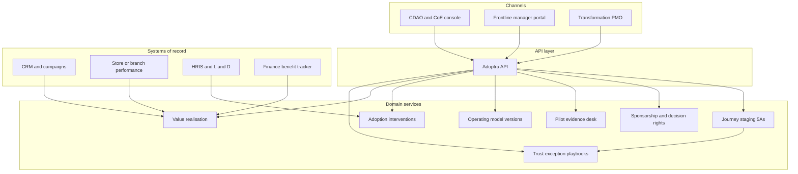

# Adoptra

**Source:** `ai-in-enterprise/Accenture-Analytics-The-5As-Of-Analytics-Transformation/`
**Domain:** `ai-enterprise`
**One-liner:** An analytics change-operating system that runs the Align–Act–Adjust–Adopt–Adapt journey so CDAOs turn insight investments into role-based decision habits instead of unused models.
**Wedge:** Retail banking and large-format retail Analytics CoEs mid-transformation (post-pilot, pre-enterprise scale) where day-one uptake of analytics tools is still measured in single digits.
**Positioning:** A decision-rights and adoption control plane for insight-powered enterprises. Most analytics platforms measure model accuracy and dashboard views; Adoptra measures whether leaders, frontline roles, and operating procedures actually changed — because the source thesis is that culture and change capacity, not technology, are the binding constraint.

## Market research synthesis

### Thesis from source

The document argues that enterprises are pouring capital into data lakes, CoEs, data scientists, and cloud hardware, yet most still fail to become “insight-powered” — a culture where data-driven insights support decisions at every level. Accenture–MIT research cited in the paper shows **92% of high performers report significant ROI from analytics versus only 24% of low performers**. High performers are twice as likely to adopt analytics for decision-making (**92% vs 48%**). The gap is attributed to change barriers, not tool selection: C-level commitment is nearly three times higher among high performers (**89% vs 37%**); **81%** of high performers foster a culture of experimentation versus **25%** of low performers; more than **50%** of low performers cite politics and inability to change; **75%** of high performers empower decisions at lower levels.

The paper’s core framework is the **5As change journey** — Align (leaders and mission), Act (prove value at small scale), Adjust (operating model from learnings), Adopt (scale with design-led stakeholder engagement), Adapt (rewrite decision processes so analytics becomes cultural DNA). Two case patterns anchor the product: a European bank targeting **10–15%** operating-income uplift from analytics, moving insight-driven sales from **4% toward a >75%** ambition, with a three-month pilot that produced **>350%** campaign sales uplift versus control — then nearly stalled when branch managers treated analytics as a black box until WIIFM training and outcome-based (not call-count) metrics fixed trust. A North American retailer shifted from store/product-centric to customer-centric performance management with **12 actionable metrics**, pilot-to-100-store ramp, and **5–10%** store operating-income lift. The paper’s blunt budget prescription: companies should invest **10–15% of overall analytics program budget in driving adoption**, or risk Ferrari-keys-to-a-16-year-old failure modes where technology launches and business uptake stays in the single digits.

### Buyer & economic model

- **Primary buyer:** Chief Data and Analytics Officer (CDAO) or Head of Analytics Transformation / Analytics CoE lead accountable for ROI of the insight program.
- **Users:** change leads and design facilitators (daily), analytics champions and CoE delivery managers (daily), business sponsors and frontline managers (weekly rituals), HR/L&D for role redesign, finance for benefit tracking.
- **Budget owner / value metric:** share of analytics program budget ring-fenced for adoption (target 10–15%); primary value metric is **insight-driven decision rate** and attributable operating-income lift per journey stage, not model count.
- **Competing status quo:** PowerPoint roadmaps, ad-hoc change communications and training bolted on after tech delivery, CoE backlog tools that track tickets not decision behaviors, and consulting-led “transformation waves” that end when the slide deck is delivered.

### Domain constraints

- **Regulatory / trust / safety:** decision rights must remain auditable when models influence regulated customer outcomes (credit, advice, pricing); explainability for frontline users is a trust requirement, not a nice-to-have.
- **Data sensitivity:** change maps and stakeholder assessments contain political sensitivity; performance contests and leaderboard data must not create privacy or labor-relations incidents.
- **Change-management realities:** relationship-oriented cultures resist “black box” mandates; sponsorship must be top-down while engagement is bottom-up; pilots that skip Adjust create Adopt failures; measurement must move from activity compliance (e.g., 10 lead calls) to outcome quality of insight-qualified actions.

## Business requirements

- BR-1: Every analytics initiative must be staged on the 5As journey with explicit exit criteria per stage; no initiative may be marked “Adopt” without documented Act/Adjust learnings.
- BR-2: Sponsorship health must be measurable — named executive sponsors, decision rights, and C-level engagement frequency — with alerts when sponsorship falls below the high-performer pattern the source describes.
- BR-3: At least 10–15% of program budget must be plannable and reportable against adoption activities (training, champions, contests, operating-procedure redesign), separate from technology delivery spend.
- BR-4: Pilots must produce a control-comparable business outcome within a defined Act window (e.g., campaign uplift or store KPI delta) before scale funding is released.
- BR-5: Frontline roles that consume insights must have documented WIIFM narratives, role-based training completion, and a simplified consumption experience; “black box” trust scores below threshold block Adopt.
- BR-6: Decision metrics must shift from activity compliance to insight-qualified outcomes where the initiative claims Adapt maturity.
- BR-7: Stakeholder engagement coverage (champions, change agents, contest participation) must be tracked at scale, not only executive workshops.
- BR-8: Operating-model Adjustments (CoE interaction model, SLAs to business units, insight branding) must be versioned and linked to pilot learnings.
- BR-9: Value realisation must report insight-driven sales or equivalent decision share versus baseline (e.g., bank path from 4% toward 75%).
- BR-10: Exception path: if day-one uptake is single-digit after launch, the system must force a trust-rebuild playbook (case-for-change, quick wins, stakeholder remapping) rather than more training alone.
- BR-11: Audit export must show who changed which decision right, when, and under which sponsor — suitable for transformation PMO and board reporting.
- BR-12: Contests and recognition programs must be configurable as first-class adoption interventions with attributable KPI movement, not informal side channels.

## User stories

Canonical user stories live in sibling [USER_STORIES.md](USER_STORIES.md).

## System design

### Overview

Adoptra is the system of record for analytics *change*, not for models. Initiatives are registered with target value (e.g., operating-income lift, insight-driven sales share), mapped to the 5As stages, and instrumented with sponsorship health, stakeholder maps, pilot evidence, operating-model versions, adoption interventions (training, contests, champions), and decision-metric redesigns. Integrations pull usage and outcome signals from CRM, campaign, and store-performance systems so Adapt is proven by behavior and P&L movement — not by slide progress.

### Actors & boundaries

- **Actors:** CDAO, CoE lead, change lead, frontline managers, business sponsors, PMO/admin, L&D.
- **Trust boundary:** Adoptra stores political and performance-sensitive change data; business outcome systems remain systems of record for revenue and risk decisions. Adoptra never silently alters operational decisions — it governs whether humans and processes are ready to consume them.
- **Human-in-the-loop points:** stage-gate approvals; trust-rebuild playbook activation; decision-metric redesign sign-off; contest design approval.

### Core capabilities

1. **Journey staging (5As)** — initiative lifecycle with exit criteria and forced Adjust before Adopt.
2. **Sponsorship and decision rights** — sponsor map, empowerment depth, escalation.
3. **Pilot evidence desk** — Act experiments with control comparison and learnings log.
4. **Operating-model versioning** — CoE interaction models, SLAs, insight branding.
5. **Adoption interventions** — training, champions, contests, WIIFM packs, change networks.
6. **Decision-metric redesign** — shift from activity compliance to insight-qualified outcomes.
7. **Value realisation** — insight-driven decision share and attributable income lift.
8. **Trust and exception playbooks** — single-digit uptake freeze and rebuild path.
9. **Governance and audit** — budget ring-fence, stage freezes, exportable history.

### Conceptual data

- **Primary entities:** Initiative, JourneyStage, Sponsor, DecisionRight, StakeholderMap, PilotExperiment, OperatingModelVersion, AdoptionIntervention, TrainingCompletion, Contest, DecisionMetric, ValueRealisationSnapshot, TrustSignal, AuditEvent.
- **Critical events:** stage advanced or blocked, sponsor assigned, pilot completed, trust score breached, adoption budget reallocated, decision metric activated, contest scored, audit export issued.
- **Retention / audit needs:** stage history and decision-rights changes retained for the full transformation and regulatory lookback; personal performance contest data minimised and time-boxed.

### Integrations (conceptual)

- **Systems of record:** CRM and campaign platforms (insight-driven sales), store/branch performance systems, HRIS for role and training, finance benefit trackers, CoE backlog tools (read-only for demand context).
- **Upstream signals:** dashboard/tool usage, campaign response, NPS/trust surveys, L&D completion feeds.
- **Downstream actions:** stage-gate notifications, training assignments, contest launches, PMO board packs, budget reallocation recommendations.

### High-level architecture

### Success metrics

- **Leading:** % of initiatives with complete Act evidence before Adopt; adoption budget share in 10–15% band; sponsorship engagement frequency; frontline trust-score trend; training and champion coverage.
- **Lagging:** insight-driven sales or decision share versus baseline; attributable operating-income lift (bank 10–15% target pattern; retailer 5–10% store income pattern); time from tech-ready to business uptake above single-digit threshold; high-performer gap closure on experimentation and lower-level empowerment proxies.

## OpenAPI skeleton

Canonical HTTP surface lives in sibling [openapi.yaml](openapi.yaml). Summary:

- **Base path:** `/v1/...`
- **Auth:** `X-API-Key` for system integrations; Bearer JWT for operators.
- **Resource groups:** Initiatives, Journey, Sponsors, Pilots, Adoption, Value, Governance.
