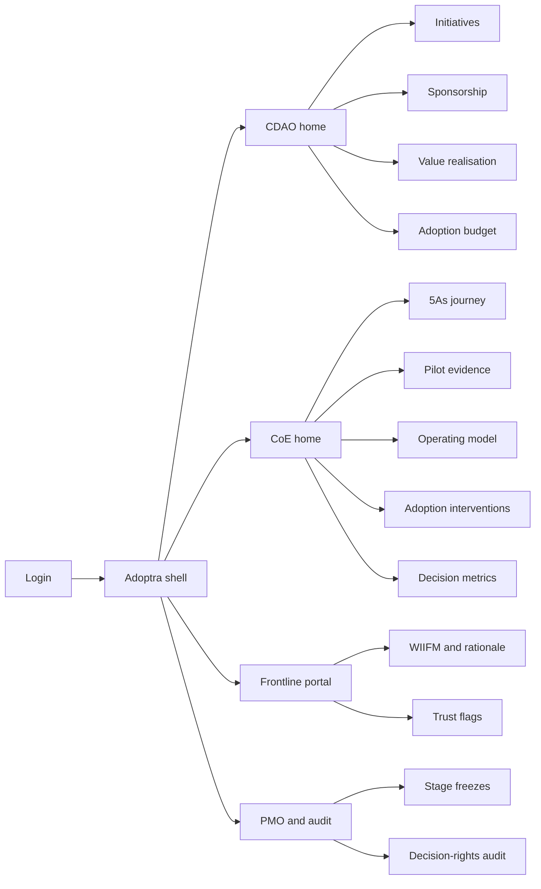
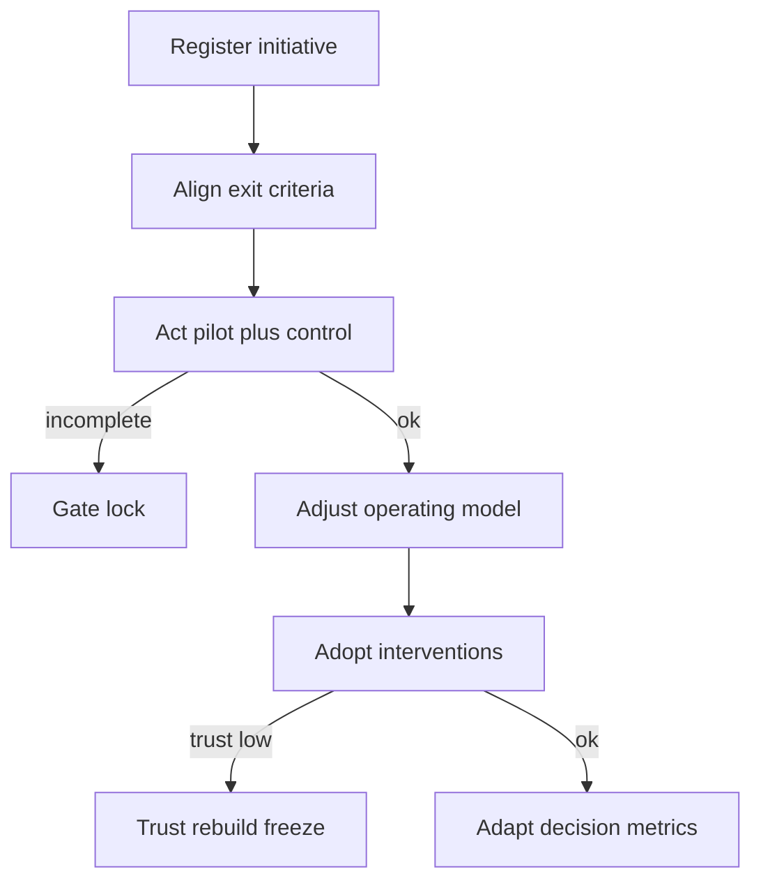

# Adoptra — Web app

**Product:** [PRODUCT.md](./PRODUCT.md)
**Primary surface:** CDAO / Analytics CoE change console (5As journey operating system)
**Secondary surfaces:** Frontline manager trust portal (WIIFM + insight rationale + trust flags); board/PMO export viewer (read-only pack)
**Design thesis:** Adoptra is a change runway, not a model gallery — the UI metaphor is a staged gate sequence (Align → Act → Adjust → Adopt → Adapt) where each initiative is a vehicle that cannot jump stages without exit evidence. Visual language is deep navy ground with signal-amber stage blockers and adoption-teal confirmation when decision habits move, not when dashboards load. The brand wordmark anchors every stage-gate and budget-ring-fence screen so sponsors know they are managing uptake, not another BI tile farm.

## UX research synthesis

### Category peers (best-in-class)

- **ServiceNow Strategic Portfolio Management:** Stage-gate portfolios with explicit exit criteria, demand → project → outcome linkage, and freeze/hold states. Steal: initiative kanban that refuses “Adopt” without prior stage artifacts; reject SPM’s IT-project vocabulary where Adoptra speaks decision rights and insight-driven sales share.
- **Whatfix / WalkMe (DAP):** Role-based adoption journeys, completion maps, and in-context guidance for frontline tools. Steal: train-the-trainer coverage heatmaps and day-one uptake alerts; reject DAP chrome that treats “clicked the tip” as transformation success.
- **Pendo / Gainsight PX:** Behavioral funnels and adoption segments tied to outcomes. Steal: insight-driven decision share as the lagging KPI next to activity; reject product-analytics “NPS widget” aesthetics that underplay political sponsorship risk.
- **Prosci / Proxima change workspaces:** Sponsor maps, resistance logs, and reinforcement plans as first-class objects. Steal: sponsorship health scoring with named executives; reject generic ADKAR checklists disconnected from Act pilot P&L evidence.

### Patterns to adopt / reject

- **Adopt:** Linear 5As stage chrome with locked gates; adoption budget as a persistent % ring-fence; control-comparable pilot cards; WIIFM packs beside every frontline insight; trust-score breach → freeze banner; contests as instrumented interventions with KPI attribution.
- **Reject:** Model-accuracy leaderboards as home; “transformation complete” when tech launches; rainbow OKR tiles; purple “AI coach” sidebars; editable historical stage exits; activity-call-count as Adapt proof.

### Trust, density, and workflow constraints from PRODUCT.md

Political stakeholder maps and contest leaderboards are sensitive (labor/privacy): role-gate performance detail and time-box contest data. Regulated customer outcomes require auditable decision-rights history (BR-11). Single-digit day-one uptake must force a trust-rebuild playbook, not more LMS modules (BR-10). Adopt is blocked without Act/Adjust learnings (BR-1). Frontline trust below threshold blocks scale (BR-5). Density stays PMO-grade on the CoE console; the frontline portal stays plain-language and low-chrome.

## Information architecture

### Nav model

### Roles → default home

| Role | Default home | Why |
|------|--------------|-----|
| CDAO / transformation sponsor | CDAO home — insight-driven decision share + sponsorship alerts | ROI and politics are the binding constraint |
| Analytics CoE lead | CoE home — initiatives blocked at gates | Daily Act/Adjust evidence work |
| Change lead / design facilitator | Adoption interventions | Contests, champions, training maps (BR-7, BR-12) |
| Frontline manager (branch/store) | Frontline portal — today’s insight-qualified actions | WIIFM and trust, not PMO density |
| Transformation PMO / admin | Freeze and audit | Board evidence (BR-11) |
| Finance benefit owner | Value realisation | Attributable income lift (BR-9) |

### Cross-links to OpenAPI resources

| Nav area | OpenAPI tags / resources |
|----------|---------------------------|
| Initiatives / stage | Initiatives, Journey |
| Sponsorship / decision rights | Sponsors |
| Pilot evidence | Pilots |
| Training, contests, champions | Adoption |
| Insight-driven share / income lift | Value |
| Adoption budget, freezes | Governance |

## Screen inventory

### CDAO home

- **Purpose:** Answer “are we becoming insight-powered, or just shipping models?” in one composition.
- **Entry:** Post-login for CDAO; deep link from sponsorship or uptake alerts.
- **Layout regions:** Brand + program switcher; primary strip (insight-driven decision share vs baseline, adoption budget %, sponsorship health by BU); initiative stage distribution; alerts rail (single-digit uptake freezes, trust breaches, missing Act evidence).
- **Primary actions:** Open blocked initiative; reallocate adoption budget; export board pack.
- **Empty / loading / error:** Empty = register first initiative against a value thesis; loading = skeleton strip + stage bars; error = retry with request id.
- **BR / story ties:** BR-2, BR-3, BR-9; CDAO stories.

### Initiative list and register

- **Purpose:** Register use cases with target value and keep them from skipping the 5As.
- **Entry:** Nav → Initiatives; CTA from home.
- **Layout regions:** Filterable table (stage, sponsorship status, uptake %, value thesis); create drawer (target OI lift or decision share, BU, CoE owner).
- **Primary actions:** Create; open journey; request stage advance; freeze.
- **Empty / loading / error:** Empty = banking/retail templates (campaign uplift, store customer-centric metrics); validation blocks Adopt without Act/Adjust docs.
- **BR / story ties:** BR-1; CDAO/CoE stories.

### 5As journey board

- **Purpose:** Stage each initiative with explicit exit criteria; force Adjust before Adopt.
- **Entry:** Initiative detail → Journey; CoE default deep link.
- **Layout regions:** Horizontal Align–Act–Adjust–Adopt–Adapt track; exit-criteria checklist per stage; evidence attachments; blocker reasons; advance/freeze controls.
- **Primary actions:** Mark criterion met; attach learning; advance stage; return to Adjust.
- **Empty / loading / error:** Missing criterion = amber gate lock with plain-language gap; freeze = coral banner naming playbook.
- **BR / story ties:** BR-1, BR-8, BR-10.

### Sponsorship and decision rights

- **Purpose:** Make C-level engagement and empowerment depth measurable and alertable.
- **Entry:** CDAO nav → Sponsorship; initiative sidebar.
- **Layout regions:** Named sponsor map; engagement frequency vs high-performer pattern; decision-rights tree (what frontline may decide); escalation path; health score by BU.
- **Primary actions:** Assign sponsor; log engagement; change decision right (audited); alert on drift.
- **Empty / loading / error:** No sponsor = blocking for Act funding; political sensitivity watermark on maps.
- **BR / story ties:** BR-2, BR-11; empowerment stories.

### Pilot evidence desk

- **Purpose:** Capture control-comparable Act outcomes before scale money moves.
- **Entry:** Journey Act stage; CoE → Pilots.
- **Layout regions:** Experiment card (window, control, treatment); uplift/KPI delta; learnings log; “fund Adjust” recommendation; attach campaign/store feeds status.
- **Primary actions:** Complete pilot; publish learnings; release Adjust funding; reject vanity demo.
- **Empty / loading / error:** No control = cannot complete; incomplete window = countdown.
- **BR / story ties:** BR-4; CoE pilot stories.

### Operating-model versions

- **Purpose:** Version CoE interaction model, SLAs, and insight branding after Adjust learnings.
- **Entry:** Journey Adjust; CoE → Operating model.
- **Layout regions:** Version timeline; SLA diffs; champion role defs; insight packaging/brand kit; link back to pilot learning ids.
- **Primary actions:** Publish new version; compare to prior; require link to Act evidence.
- **Empty / loading / error:** Orphan version without pilot link = blocked publish.
- **BR / story ties:** BR-8.

### Adoption interventions

- **Purpose:** Plan and instrument training, champions, contests, and WIIFM — the 10–15% budget work.
- **Entry:** Change lead home; CoE → Adoption.
- **Layout regions:** Intervention backlog; coverage map by role/site; contest designer with target behavior + KPI link; train-the-trainer completion; budget drawdown against ring-fence.
- **Primary actions:** Launch contest; assign training; open WIIFM pack editor; score contest.
- **Empty / loading / error:** Empty = suggest 30-day challenge template; contest data retention banner.
- **BR / story ties:** BR-3, BR-5, BR-7, BR-12.

### Decision-metric redesign

- **Purpose:** Replace activity compliance (call counts) with insight-qualified outcome metrics for Adapt claims.
- **Entry:** Journey Adopt/Adapt; Metrics nav.
- **Layout regions:** Current vs proposed metric definitions; sign-off workflow; activation date; impact on frontline scorecards.
- **Primary actions:** Propose redesign; sponsor sign-off; activate; rollback with audit.
- **Empty / loading / error:** Adapt claim without activated redesign = reject Adapt exit.
- **BR / story ties:** BR-6; frontline manager stories.

### Value realisation

- **Purpose:** Report insight-driven decision share and attributable operating-income lift versus baseline.
- **Entry:** CDAO → Value; finance shortcut.
- **Layout regions:** Baseline vs current share (e.g., 4% → path to 75%); OI lift bands; initiative attribution table; export.
- **Primary actions:** Refresh snapshot; export board chart; drill to initiative.
- **Empty / loading / error:** Missing CRM/store feed = integration banner, not fake zeros.
- **BR / story ties:** BR-9.

### Trust rebuild and freeze

- **Purpose:** When day-one uptake is single-digit, freeze Adopt and run case-for-change / quick wins / remap — not more training alone.
- **Entry:** Auto from uptake signal; Governance → Freeze; alert rail.
- **Layout regions:** Freeze reason; uptake trend; playbook steps checklist; stakeholder remap; quick-win log; unfreeze criteria.
- **Primary actions:** Activate playbook; assign owners; request unfreeze with evidence.
- **Empty / loading / error:** Healthy uptake = “no freezes” with last check timestamp.
- **BR / story ties:** BR-5, BR-10.

### Frontline portal — WIIFM and rationale

- **Purpose:** Give branch/store managers plain-language why for each insight-qualified action.
- **Entry:** Frontline login default.
- **Layout regions:** Today’s actions list; rationale panel; WIIFM for role; outcome metric (not call count); trust flag control.
- **Primary actions:** Act on insight; flag distrust; open training snippet.
- **Empty / loading / error:** Empty = “no assigned insights” with champion contact; mobile-first layout.
- **BR / story ties:** BR-5, BR-6; frontline stories.
- **Mobile notes:** Primary phone surface; large tap targets; offline-friendly rationale cache optional later.

### Decision-rights audit and board export

- **Purpose:** Show who changed which decision right, when, under which sponsor.
- **Entry:** PMO → Audit; CDAO export.
- **Layout regions:** Append-only event table; filters by initiative/sponsor; pack builder (stages, budget %, value, freezes).
- **Primary actions:** Export PDF/CSV; open neutrality of change history.
- **Empty / loading / error:** Empty period = no changes; attestation of completeness.
- **BR / story ties:** BR-11; PMO/compliance stories.

## Key flows

1. **Advance through 5As** — register initiative → meet Align exit → Act pilot with control → Adjust operating model → Adopt interventions → Adapt metric redesign; failure: gate lock without evidence.

2. **Pilot funds Adjust** — define experiment → run window → capture uplift vs control → publish learnings → release Adjust funding; failure: vanity demo without control rejected.

3. **Single-digit uptake freeze** — launch signal → uptake &lt; threshold → auto-freeze Adopt → playbook (case-for-change, quick wins, remap) → evidence → unfreeze; failure: training-only request rejected.

4. **Adoption budget ring-fence** — plan interventions → draw down against 10–15% band → alert when tech spend crowds out adoption → CDAO reallocate.

5. **Frontline trust flag** — manager sees rationale → flags distrust → CoE Adjust item → branding/WIIFM fix → trust score recovery before scale.

## Design system

### Tokens (CSS variables)

- `--color-ink: #E6ECF4` — primary text on dark ground
- `--color-navy-950: #0A1220` — app ground
- `--color-navy-900: #121C2E` — panels
- `--color-navy-700: #2A3A55` — rules
- `--color-teal: #2EC4B6` — stage exit met / adoption confirmation
- `--color-teal-dim: #1A6B63` — teal on dark
- `--color-amber: #E8A838` — gate incomplete / sponsorship drift
- `--color-coral: #E85D4C` — freeze / single-digit uptake
- `--color-steel: #8AA0B8` — secondary labels
- `--color-brand: #7EB8C9` — Adoptra wordmark (cool signal, not neon)
- `--font-display: "Source Sans 3", sans-serif` — chrome and KPIs
- `--font-mono: "Source Code Pro", monospace` — stage ids, audit events
- `--space-1`…`--space-8`: 4px scale
- `--radius-sm: 4px`; `--radius-md: 8px` — runway/gate, not pill-heavy
- `--motion-gate: 200ms ease-out` — stage unlock
- `--motion-freeze: 280ms ease-in-out` — coral freeze banner pulse
- Atmosphere: subtle vertical “runway” stripes in navy-900; soft top vignette; no stock transformation-handshake heroes in console.

### Typography & brand

- Display for stage names and decision-share numerals; mono for audit event ids and freeze ids.
- Brand wordmark left of shell on every gate and budget screen; never replace with generic “Dashboard” as strongest mark.
- Login/marketing shell: brand hero; one headline (“Make analytics habit, not hardware”); one CTA — no vanity ROI tile strips.

### Do / don’t

- **Do:** Lock Adopt without Act/Adjust; show adoption budget as persistent %; plain-language rationale on frontline; dual evidence for freezes; role-gate contest leaderboards.
- **Don’t:** Purple AI glow; model-accuracy as home KPI; editable settled stage exits; card grids of static OKRs; emoji for sponsorship health.

### Accessibility & domain trust cues

- Contrast AA+ on teal/amber/coral vs navy; gates also use lock/text, not colour alone.
- Live regions announce freezes and sponsorship alerts.
- Focus order follows journey: initiative → stage → pilot → adoption → value.
- Audit export is machine-readable for PMO/board.

## Component patterns

- **FiveAsTrack** — horizontal stage control with exit-criteria locks.
- **AdoptionBudgetRing** — persistent 10–15% band indicator.
- **PilotControlCard** — treatment vs control outcome.
- **SponsorshipHealthMap** — named executives + engagement frequency.
- **TrustFreezeBanner** — coral blocking state with playbook CTA.
- **WIIFMPack** — role narrative beside insight action.
- **ContestScorePanel** — behavior + attributable KPI link.
- **DecisionRightAuditRow** — append-only rights change with sponsor.

## Out of scope for v1 web

- Model training / feature store UI; full CRM replacement; native mobile trader apps beyond responsive frontline portal; consulting white-label multi-tenant agency portals; headset/AR store coaching; automated customer decisioning without human gate.
